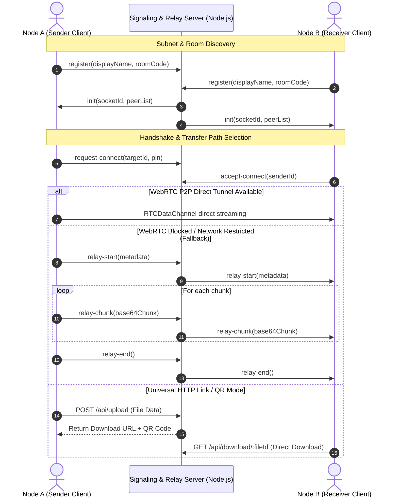

# 🌌 Aether: Local-First Multi-Method P2P & Relay Synchronization Engine

[](https://nodejs.org)
[](https://expressjs.com)
[](https://socket.io)
[](https://webrtc.org)
[](https://tailwindcss.com)

Aether is a professional-grade, multi-tiered peer-to-peer (P2P) and server-relayed file synchronization platform designed to run directly in web browsers. It establishes encrypted DTLS-SRTP communication tunnels between devices while providing automatic server relay failovers and instant HTTP QR Code links.

By combining browser-native WebRTC Data Channels, Socket.io signaling & chunked streaming relay, and Express REST file endpoints, Aether guarantees file transfers under any network condition.

---

## ⚡ Multi-Tier Fallback Sharing Architecture

Aether eliminates transfer failures by providing a 4-tier fallback mechanism:

| Tier | Transfer Mode | Description & Use Case |
| :--- | :--- | :--- |
| **Tier 1** | **⚡ WebRTC Direct P2P** | Browser-to-browser direct encrypted data tunnel. Maximum speed, zero server storage. |
| **Tier 2** | **🔄 Socket.IO Server Relay** | Automatic failover if WebRTC is blocked by strict NATs, cellular data, or corporate firewalls. Data streams securely through Socket.IO. |
| **Tier 3** | **🔗 HTTP Share Link & QR Code** | 1-click upload creating a 15-minute temporary download link + scannable QR Code. Allows sharing to any device/browser without pairing. |
| **Tier 4** | **📱 Web Share API Integration** | Native mobile device sharing (WhatsApp, Telegram, Mail, AirDrop) for generated download links. |

---

## 🏗️ Architecture & Data Flow



---

## 🛠️ Technology Stack

### Frontend Client
* **HTML5 & Vanilla JavaScript**: Frameworkless performance for raw processing speed.
* **TailwindCSS**: Glassmorphic UI with dynamic particle canvas and dark mode.
* **Simple-Peer**: WebRTC wrapper for P2P connection handling.
* **QRCode.js**: Scannable QR code generation for instant mobile transfers.
* **Web Audio & Haptics API**: Real-time sound oscillators and vibration feedback.

### Backend Server
* **Node.js & Express**: Static asset serving and HTTP REST endpoints.
* **Socket.io**: Real-time signaling, room management, and binary socket relay stream engine.

---

## 📂 Project Structure

```text
sharing-app/
├── server.js               # Express server, Socket.io relay, & HTTP file endpoints
├── package.json            # Node.js dependencies and run scripts
├── Procfile                # Heroku / Railway / Render web server definition
├── netlify.toml            # Netlify routing rules
└── public/
    ├── app.js              # Multi-tier transfer engine, WebRTC, & HTTP Share logic
    ├── index.html          # Dynamic landing interface with animated hero
    ├── void.html           # Main active transmission room ("The Void")
    ├── sw.js               # Service worker asset cacher
    ├── manifest.json       # PWA manifest configuration
    ├── logo.png            # Application logo
    ├── security.png        # Feature illustration
    └── speed.png           # Feature illustration
```

---

## 📡 API & Socket Event Protocol

### 1. HTTP REST Endpoints
* **`POST /api/upload`**: Uploads temporary file payload (Base64), returns `{ success, fileId, downloadUrl, expiresInMinutes: 15 }`.
* **`GET /api/download/:fileId`**: Downloads shared file with auto-cleanup after 15 minutes.
* **`GET /health`**: Diagnostics endpoint returning active users count, shared files count, and server uptime.

### 2. Socket Relay Protocol
* **`relay-start`**: Initiates Socket.IO server relay stream.
* **`relay-chunk`**: Transmits chunked payload securely across socket stream.
* **`relay-end`**: Concludes file reception on target client.
* **`relay-abort`**: Aborts active transmission loop cleanly.

---

## ⚙️ Installation & Running Locally

### Step-by-Step Setup

1. **Clone the Repository**
   ```bash
   git clone https://github.com/sumitsharma29/aether.git
   cd aether
   ```

2. **Install Dependencies**
   ```bash
   npm install
   ```

3. **Start the Server**
   ```bash
   npm run dev
   ```

4. **Access the App**
   * Open browser to `http://localhost:3000`.
   * For LAN testing, use the printed Network URL (e.g., `http://192.168.x.x:3000`) on another device connected to the same Wi-Fi.

---

## 🚀 Production Deployment

Deploy seamlessly to Render, Railway, Vercel, or Heroku. The application automatically resolves socket endpoints to `window.location.origin` without needing hardcoded URLs.
