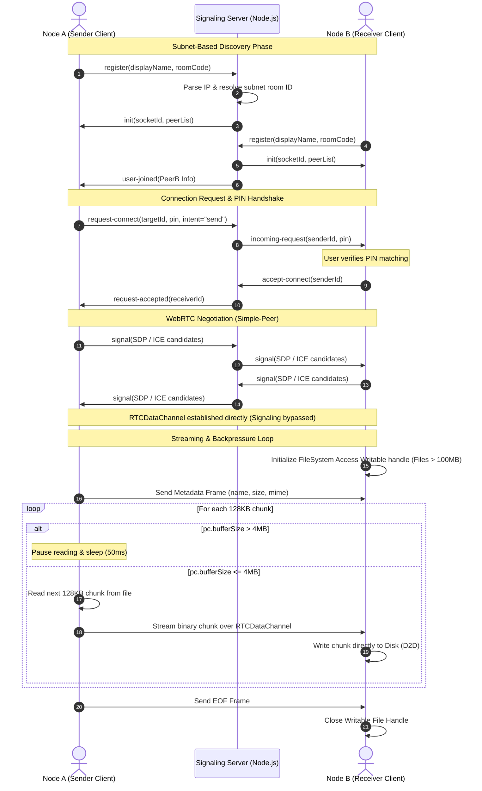

# 🌌 Aether: Local-First P2P Synchronization Engine

[](https://nodejs.org)
[](https://expressjs.com)
[](https://socket.io)
[](https://webrtc.org)
[](https://tailwindcss.com)

Aether is a professional-grade, local-first peer-to-peer (P2P) file synchronization platform designed to run directly in web browsers. It establishes encrypted DTLS-SRTP communication tunnels between devices, bypassing cloud storage intermediate servers, data volume caps, and third-party privacy concerns. 

By combining browser-native WebRTC Data Channels, Socket.io signaling, and the modern FileSystem Access API, Aether streams files of arbitrary size directly from the sender's local storage to the receiver's disk. This architecture prevents standard browser memory allocation limits from crashing browser tabs during gigabyte-scale transfers.

---

## 🏗️ Architecture & Data Flow

Aether relies on a decoupled design: a lightweight node-based signaling server for network discovery and connection handshakes, and an event-driven frontend client that manages direct WebRTC transport and disk streaming.



### 1. Subnet-Based Auto-Discovery

When a client connects, the signaling server extracts its public IP address (accounting for HTTP reverse proxies using the `x-forwarded-for` header). The server splits the IP address to group clients sharing the same network segment. Users on the same local subnet are automatically grouped into a single signaling room, enabling local discovery without prior user configuration. If clients are on separate networks, discovery falls back to an alphanumeric room code.

### 2. Ephemeral PIN Verification

To protect clients from unsolicited connection requests on public networks, Aether implements a out-of-band PIN verification step. When Node A requests a connection with Node B, it generates a random 4-digit code and registers it with the signaling server. The receiving client must display the matching code to the user. Accepting the handshake authorizes the exchange of WebRTC Session Description Protocol (SDP) packets.

### 3. Flow-Controlled Data Channel Transport

Data is packetized into `128KB` binary chunks. Slicing files and transmitting chunks over WebRTC data channels in an unthrottled loop leads to rapid memory allocation and WebRTC buffer overflow, crashing the browser tab. To prevent this, the sending engine implements an active backpressure monitor checking the data channel's `bufferedAmount` before transmitting the next chunk.

---

## 🛠️ Technology Stack & Justification

### Frontend Client

* **HTML5 & Vanilla Javascript (ESM)**: Built without bulky frameworks (React, Vue) to optimize execution speed, minimize bundle sizes, and keep the file transfer process near browser metal.
* **TailwindCSS**: Used for a professional, glassmorphic dark-mode user interface.
* **Simple-Peer**: A wrapper library for WebRTC. Handles browser compatibility issues, ICE candidate pooling, and SDP negotiation, providing a clean event-driven interface for raw data channel sockets.
* **FileSystem Access API (`showSaveFilePicker`)**: Used to stream binary data streams directly to local storage, keeping the browser's heap footprint low and stable regardless of file size.
* **Web Audio API**: Implements real-time synthesizer oscillators (`createOscillator`) for sound feedback. This eliminates the need to download static audio files, keeping network overhead minimal.
* **Web Vibration API (`navigator.vibrate`)**: Provides haptic confirmation during handshake requests and transfer completions on mobile devices.

### Signaling Server

* **Node.js & Express**: Provides a lightweight and fast execution stack for static file serving and server-side logic.
* **Socket.io**: Establishes persistent WebSockets connection streams between active clients. Chosen for its automatic fallback to HTTP long polling and automatic reconnection mechanism under spotty network conditions.

---

## 📂 Project Structure

```text
sharing-app/
├── server.js               # Express server & Socket.io subnet routing logic
├── package.json            # Node.js dependencies, metadata, and start scripts
├── netlify.toml            # Deployment routing rules & single-page app rewrites
├── node_modules/           # Node.js dependency installations (ignored)
└── public/
    ├── app.js              # WebRTC handshake, backpressure control, & D2D stream engine
    ├── index.html          # Dynamic landing interface with particle mesh animation
    ├── void.html           # Active transmission room interface (The Radar screen)
    ├── sw.js               # Service Worker structure for offline capability
    ├── manifest.json       # Progressive Web App configuration file
    ├── _redirects          # SPA client routing redirects for edge hosts
    ├── logo.png            # Application logo resource
    ├── security.png        # Informational security graphic
    └── speed.png           # Informational speed graphic
```

---

## ⚙️ Core Technical Challenges & Solutions

### 1. WebRTC Data Channel Backpressure Control

* **The Challenge**: WebRTC data channels (`RTCDataChannel`) do not have automatic TCP-like network backpressure controls. When transmitting a large file (e.g. 2GB), slicing it and calling `pc.send()` in a tight loop fills up the browser's internal outgoing buffer faster than the network can transmit the data. This causes the browser heap memory to balloon, eventually throwing out-of-memory errors and crashing the tab.
* **The Solution**: Aether monitors the socket buffer size during transmission. By querying the `bufferSize` property on the `SimplePeer` object, Aether pauses the file reader loop whenever the buffered queue exceeds `4MB`. The loop yields control back to the browser's event loop via a short timeout and checks again, resuming transmission only after the buffer has cleared.

```javascript
// Throttling engine loop in public/app.js
while (offset < file.size) {
    if (shouldAbort) {
        pc.send(JSON.stringify({ type: 'abort' }));
        return;
    }

    // Monitor buffered queue to prevent memory overflow (4MB Threshold)
    if (pc.bufferSize > 4 * 1024 * 1024) {
        await new Promise(r => setTimeout(r, 50));
        continue;
    }

    const chunk = await readChunk(file, offset);
    pc.send(chunk);
    offset += chunk.byteLength;

    // Calculate real-time speed metrics
    const percent = Math.round((offset / file.size) * 100);
    const elapsed = (Date.now() - startTime) / 1000;
    const speed = (offset / 1024 / 1024 / (elapsed || 0.1)).toFixed(2);
    
    updateUIProgress(percent, speed);
}
```

### 2. Large File Disk Writing (D2D) vs Mobile Memory Fallback

* **The Challenge**: Standard web downloads collect all incoming binary chunks in an in-memory array, convert the array to a single `Blob`, and generate an object URL for download. This approach consumes memory proportional to the file size. A 1.5GB file transfer will crash mobile browser tabs and low-spec computers due to RAM limits.
* **The Solution**: Aether implements a dual-mode ingestion strategy. On modern desktop browsers, Aether requests a direct file handle using the FileSystem Access API (`window.showSaveFilePicker`). Incoming binary packets are piped directly to disk via `FileSystemWritableFileStream.write(data)`. Memory usage stays flat at around `128KB` (the chunk size). On mobile browsers (Safari/Chrome on iOS/Android) where this API is absent, Aether falls back to standard memory buffering for files under 100MB.

```javascript
// Dual-mode incoming stream handling in public/app.js
if (msg.type === 'metadata') {
    incomingFileData = { metadata: msg, chunks: [], receivedSize: 0, startTime: Date.now() };
    
    // Direct-to-Disk streaming setup for large files
    if ('showSaveFilePicker' in window && msg.size > 100 * 1024 * 1024) {
        try {
            fileHandle = await window.showSaveFilePicker({ suggestedName: msg.name });
            fileWriter = await fileHandle.createWritable();
            isStreamingToDisk = true;
        } catch (e) {
            console.error('FileSystem Access denied, falling back to RAM mode');
            fileWriter = null;
        }
    }
}

// Write chunk process
if (fileWriter) {
    await fileWriter.write(data); // Constant RAM usage
} else {
    incomingFileData.chunks.push(data); // In-memory fallback
}
```

### 3. Local Subnet Discovery Behind Reverse Proxies

* **The Challenge**: When deploying signaling servers on platforms like Render or Heroku, incoming connections pass through HTTP reverse proxies. The socket handshake remote address returns the proxy's IP address rather than the client's public IP. This breaks the IP-based automatic grouping.
* **The Solution**: The signaling server inspects the `x-forwarded-for` header to extract the client's actual public IP. It then parses the IP (both IPv4 and IPv6 formats) and groups clients by their network prefix (the first two segments of the IP address).

```javascript
// Proxy IP extraction and subnet matching in server.js
const rawIp = socket.handshake.headers['x-forwarded-for'] || socket.request.socket.remoteAddress;
const clientIp = rawIp.split(',')[0].trim().replace(/^.*:/, '');

function getNetworkRoom(ip) {
    let cleanIp = ip.replace(/^::ffff:/, '');
    
    // Group by the first two segments of the IP address
    if (cleanIp.includes('.')) {
        return `ip-${cleanIp.split('.').slice(0, 2).join('.')}`;
    } else if (cleanIp.includes(':')) {
        return `ip-${cleanIp.split(':').slice(0, 2).join(':')}`;
    }
    return `ip-${cleanIp}`;
}
```

---

## 📡 Protocol Schema & Event Definitions

### 1. Signaling Protocol (Socket.io)

Clients coordinate WebRTC handshakes using the following Socket.io message definitions:

| Event Name | Payload | Sender | Description |
| :--- | :--- | :--- | :--- |
| `register` | `{ displayName: string, roomCode: string }` | Client | Registers client name and room code on the signaling network. |
| `init` | `{ id: string, peers: Array<{id, displayName}> }` | Server | Sends the new client its unique socket ID and a list of active peers in its room. |
| `user-joined` | `{ id: string, displayName: string }` | Server | Notifies existing clients in a room that a new peer has entered. |
| `request-connect` | `{ targetId: string, intent: string, pin: string }` | Client | Requests a direct connection handshake with a target peer. |
| `incoming-request` | `{ senderId: string, senderName: string, pin: string }` | Server | Forwards connection request and authorization PIN to the target peer. |
| `accept-connect` | `{ senderId: string }` | Client | Signals approval of the connection request and triggers WebRTC initialization. |
| `request-accepted` | `{ receiverId: string }` | Server | Notifies the connection initiator that their request has been approved. |
| `signal` | `{ target: string, signal: object }` | Client | Proxies WebRTC SDP offers, answers, and ICE candidates to the target peer. |
| `user-left` | `socketId: string` | Server | Notifies a room when a peer disconnects. |

### 2. Data Channel Protocol (RTCDataChannel)

Binary data and synchronization control state are framed using a string-prefixed message protocol:

* **Metadata Frame**: Sent before transmission starts to define file dimensions.

  ```json
  { "type": "metadata", "name": "document.pdf", "size": 1048576, "mime": "application/pdf" }
  ```

* **Binary Chunk Stream**: Raw binary packets (`Uint8Array` / `ArrayBuffer`) are sent sequentially.
* **EOF Frame**: Sent to notify the receiver of transfer completion.

  ```json
  { "type": "eof" }
  ```

* **Abort Frame**: Sent if the user hits the cancel button, triggering cleanups on both ends.

  ```json
  { "type": "abort" }
  ```

---

## ⚙️ Installation & Local Development

### Prerequisites

* **Node.js**: Version 18.0 or higher.
* **npm**: Version 9.0 or higher.

### Step-by-Step Setup

1. **Clone the Repository**

   ```bash
   git clone https://github.com/sumitsharma29/aether.git
   cd aether
   ```

2. **Install Dependencies**

   ```bash
   npm install
   ```

3. **Start the signaling and asset server**

   ```bash
   npm run dev
   ```

4. **Access the application**

   * Open your browser to `http://localhost:3000`.
   * To test local peer discovery, copy the **Network IP** address logged in the terminal (e.g. `http://192.168.1.5:3000`) and open it on another device (such as a smartphone) connected to the same local Wi-Fi router.

---

## 🔮 Roadmap & Future Improvements

1. **TURN Server Relay Integration**: WebRTC connections will fail if both peers are behind strict symmetric NATs. Integrating a TURN server relay (e.g. via Coturn) will act as a fallback network path when direct P2P connections cannot be established.
2. **Web Worker Slicing**: Moving the `FileReader` slicing engine and WebRTC chunk streaming loop into a background Web Worker. This offloads CPU-heavy operations from the browser UI thread, ensuring the dashboard animations stay smooth at 60fps during file transfers.
3. **End-to-End Encryption Overlay (AES-GCM)**: Adding an extra layer of encryption via the Web Crypto API on top of WebRTC's default DTLS security. This ensures absolute privacy by deriving cryptographic keys directly from the handshake PIN, preventing signaling intercept hazards.
