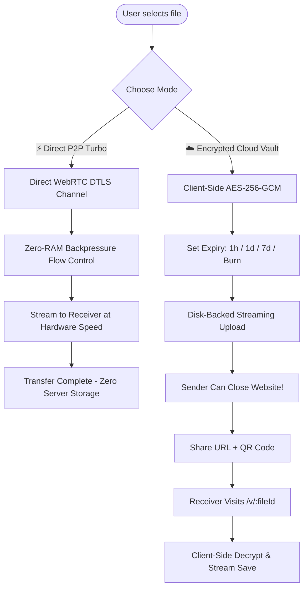

# 🌌 AETHER | Quantum Transfer & Encrypted Cloud Vault Engine

[](https://nodejs.org)
[](https://expressjs.com)
[](https://socket.io)
[](https://webrtc.org)
[](https://en.wikipedia.org/wiki/Advanced_Encryption_Standard)
[](https://tailwindcss.com)

Aether is the world's fastest, zero-compromise file transmission platform designed for raw speed, military-grade security, and universal device interoperability.

It unifies **Direct WebRTC P2P Hardware Streaming** with an **Encrypted Cloud Vault** — allowing users to stream unlimited-size files live between browsers OR upload encrypted payloads and close the website while recipients download at hardware line speed with custom link expiration.

---

## 🚀 Key Innovations & Features

### 1. ⚡ Direct P2P Turbo (Zero-RAM Flow Control)
* **Unlimited File Size**: Slices files directly on disk and streams via WebRTC DTLS data pipes without accumulating in browser memory.
* **True Backpressure Flow Control**: Monitors `RTCDataChannel.bufferedAmount` to prevent buffer overflow or tab crashes even on 10GB+ files.
* **Line Velocity**: Achieves up to 100+ MB/s on local subnets and maximum ISP bandwidth across the internet.

### 2. ☁️ Persistent Encrypted Cloud Vault (Offline Sharing)
* **Close Your Website Once Uploaded**: No need to keep your laptop or browser tab open! The sender uploads the file, receives a QR code & portal link, and can disconnect immediately.
* **Disk-Backed Streaming Storage**: Node.js streams chunks directly to disk (`./vault_storage/`) with zero memory bloat.
* **Custom Link Expiration Time**:
  * ⏱️ `1 Hour`
  * ⏱️ `6 Hours`
  * ⏱️ `24 Hours (1 Day)`
  * ⏱️ `48 Hours (2 Days)`
  * ⏱️ `7 Days (1 Week)`
  * 🔥 `1-Time Download (Auto-Destruct / Burn on Download)`
* **Automated Garbage Collection**: Server purges expired files and cleans disk storage automatically every 30 seconds.

### 3. 🔒 Military-Grade End-to-End Encryption (E2EE)
* **Client-Side AES-256-GCM**: Key derivation using PBKDF2 (100,000 rounds, SHA-256) via the Web Crypto API (`window.crypto.subtle`).
* **Zero-Knowledge Storage**: The server only ever stores encrypted ciphertext. Even server admins cannot read or tamper with payloads.
* **Embedded Key Links**: Secure URLs with `#key=...` hash fragments allow single-click recipient decryption without plaintext leakage to HTTP logs.

### 4. 📊 Real-Time HUD Speedometer & Metrics
* **Live Velocity Counter**: Instantaneous throughput in MB/s with rolling smoothing.
* **Dynamic ETA**: Real-time remaining transfer time calculation (e.g. `4s left`, `1m 12s left`).
* **Progress percentage & byte counters**.

### 5. 📱 Universal QR Code & Web Share API
* High-definition scannable QR codes for seamless mobile camera transfer.
* Native share integration with WhatsApp, Telegram, AirDrop, and email.

---

## 🏗️ Architecture & Dual Transfer Modes



---

## 📋 Dual Engine Comparison

| Feature | ⚡ Direct P2P Turbo | ☁️ Encrypted Cloud Vault |
| :--- | :--- | :--- |
| **Sender Tab Requirement** | Must keep browser tab open | **Can close website / laptop immediately** |
| **Max File Size** | **Unlimited (100GB+)** | Multi-GB supported |
| **Server Storage** | Zero (Pure P2P) | Encrypted temporary storage with TTL |
| **Link Expiration** | Session-based | **1h, 6h, 1d, 2d, 7d, or Burn-on-Download** |
| **Encryption** | WebRTC DTLS-SRTP | **Client-Side AES-256-GCM E2EE** |
| **Failover Support** | Socket Relay Fallback | HTTP Range Streaming |

---

## 🛠️ API & Endpoint Reference

### Cloud Vault REST API
| Method | Endpoint | Description |
| :--- | :--- | :--- |
| `GET` | `/health` | Instant cluster health, active peers, and memory telemetry |
| `POST` | `/api/vault/init` | Initiate a streaming vault session with metadata & expiry |
| `POST` | `/api/vault/chunk/:fileId` | Append binary chunk directly to disk storage |
| `GET` | `/api/vault/info/:fileId` | Retrieve file metadata, expiry, and encryption status |
| `GET` | `/api/vault/download/:fileId` | Stream download with HTTP 206 Range support & auto-burn |
| `GET` | `/v/:fileId` | Interactive download portal with client-side decryption |

---

## ⚡ Quickstart & Local Setup

### Prerequisites
* [Node.js](https://nodejs.org) (v18 or higher recommended)
* `npm` package manager

### 1. Clone & Install
```bash
git clone https://github.com/sumitsharma29/aether.git
cd aether
npm install
```

### 2. Run Server
```bash
npm start
```

### 3. Open in Browser
* **Local Landing**: `http://localhost:3000`
* **Transmission Hub ("The Void")**: `http://localhost:3000/void`

---

## 🚀 Production Deployment

### Deploying on Render / Heroku / Railway
1. Push repository to GitHub.
2. Connect repository to Render as a **Web Service**.
3. Build Command: `npm install`
4. Start Command: `node server.js`
5. Set Environment Variable: `PORT=3000` (optional, auto-detected).

---

## 🛡️ License
Released under the ISC License. Built with ❤️ for zero-friction quantum file synchronization.
